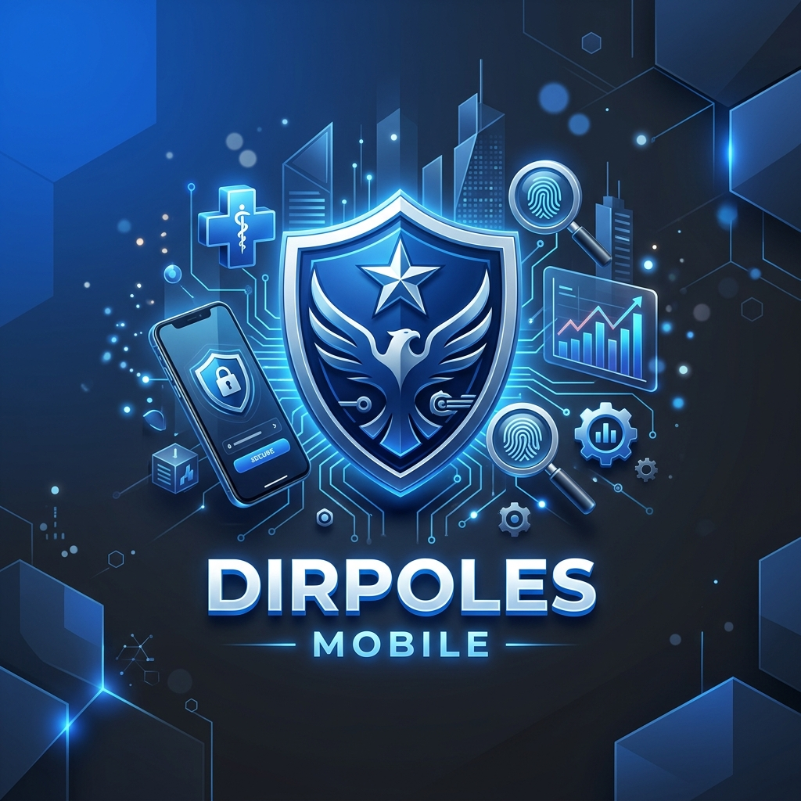

# DIRPOLES Mobile 🛡️



## 📋 Descripción

**DIRPOLES Mobile** es la solución tecnológica móvil de vanguardia diseñada para centralizar y optimizar la gestión operativa de **DIRPOLES**. Esta aplicación permite a los usuarios autorizados gestionar de manera eficiente beneficiarios, citas médicas, inventarios y visualizar reportes estadísticos avanzados, todo bajo una interfaz moderna, intuitiva y segura.

Construida con **React Native** y siguiendo los principios de arquitectura **SOLID**, la aplicación garantiza escalabilidad, facilidad de mantenimiento y un rendimiento excepcional en dispositivos móviles.

---

## ✨ Características Principales

*   **🔐 Autenticación Segura**: Inicio de sesión robusto mediante JWT y almacenamiento cifrado con `SecureStore`.
*   **📅 Gestión de Citas**: Calendario interactivo integrado para el control detallado de agendas médicas.
*   **👥 Control de Beneficiarios**: Acceso rápido y gestión de expedientes de personas asociadas.
*   **📦 Inventario en Tiempo Real**: Seguimiento preciso del stock de insumos médicos y suministros.
*   **📊 Reportes Inteligentes**: Módulo de estadísticas visuales para la toma de decisiones basada en datos.
*   **💎 UI/UX Premium**: Diseño basado en React Native Paper con iconografía de Lucide React, ofreciendo una experiencia de usuario fluida y profesional.

---

## 🚀 Tecnologías

El stack tecnológico de **DIRPOLES Mobile** ha sido seleccionado para ofrecer estabilidad y modernidad:

*   **Framework**: [React Native (Expo)](https://expo.dev/)
*   **UI Library**: [React Native Paper](https://reactnativepaper.com/)
*   **Iconos**: [Lucide React Native](https://lucide.dev/)
*   **Navegación**: [React Navigation v6](https://reactnavigation.org/)
*   **Estado Global**: React Context API
*   **Peticiones HTTP**: Axios
*   **Seguridad**: Expo Secure Store

---

## 🛠️ Instalación y Configuración

Sigue estos pasos para poner en marcha el proyecto en tu entorno local:

### 1. Requisitos Previos

*   [Node.js](https://nodejs.org/) (Versión LTS recomendada)
*   [Expo Go](https://expo.dev/client) instalado en tu dispositivo móvil o un emulador configurado.
*   Backend **DIRPOLES_4** (PHP/XAMPP) en ejecución.

### 2. Clonar el Repositorio

```bash
git clone https://github.com/tu-usuario/DIRPOLES_APP.git
cd DIRPOLES_APP
```

### 3. Instalar Dependencias

```bash
npm install
```

### 4. Configuración del Backend

Crea un archivo de configuración en `src/constants/config.js` (si no existe) y define la URL de tu API local:

```javascript
export const API_URL = 'http://TU_IP_LOCAL/DIRPOLES_4/api';
```

> **Nota**: Asegúrate de usar tu dirección IP local (ej. `192.168.1.XX`) en lugar de `localhost` para que el dispositivo físico pueda conectarse al backend de XAMPP.

### 5. Iniciar la Aplicación

```bash
npx expo start
```

Escanea el código QR con la app **Expo Go** (Android) o la cámara (iOS).

---

## 📂 Estructura del Proyecto

```text
DIRPOLES_APP/
├── assets/             # Recursos estáticos (imágenes, fuentes)
├── src/
│   ├── components/     # Componentes reutilizables
│   ├── constants/      # Configuraciones y constantes (API_URL)
│   ├── context/        # Manejo de estado global (AuthContext)
│   ├── navigation/     # Configuración de rutas (Stack, Tabs)
│   ├── screens/        # Pantallas principales de la aplicación
│   └── services/       # Lógica de comunicación con la API
├── App.js              # Punto de entrada principal
└── package.json        # Dependencias y scripts
```

---

## 🛡️ Seguridad

Esta aplicación implementa:
- Manejo de tokens JWT con vencimiento.
- Encriptación local de credenciales sensibles.
- Manejo de errores centralizado para evitar fugas de información.

---

## 📄 Licencia

Este proyecto es propiedad privada de **DIRPOLES**. Todos los derechos reservados.

---

<p align="center">Desarrollado con ❤️ por el equipo de DIRPOLES</p>
